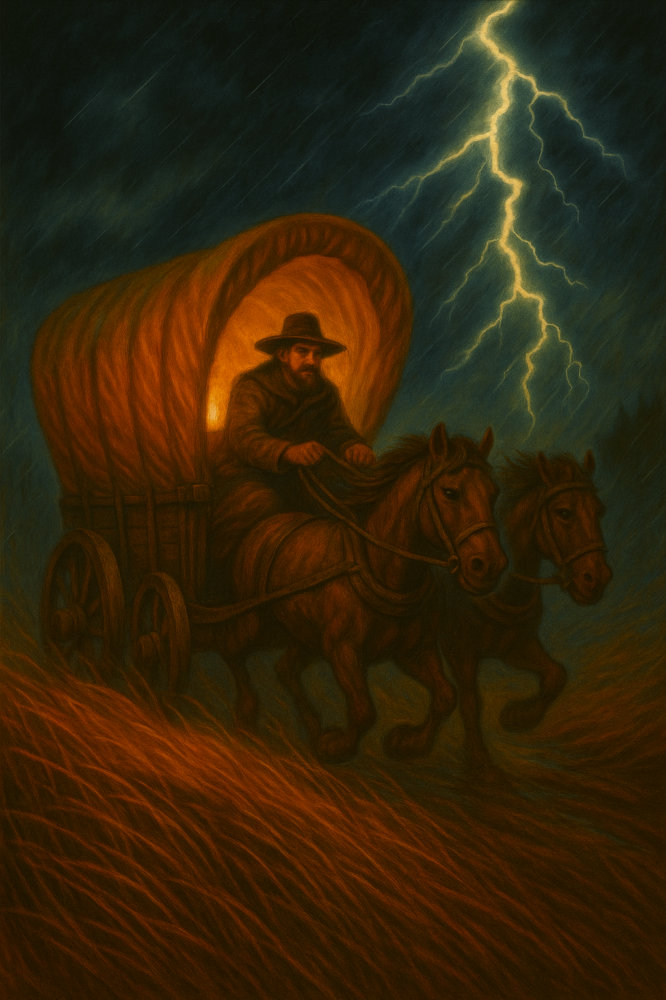

Thunder rolled across a bruised sky as the wind tugged at the oilskin flaps of Argus Leyline’s saddlebag. He sat motionless atop his mount, watching the horizon crack and boil. Somewhere out there—east, maybe north—was shelter. The wagons behind him groaned beneath crates of alchemical goods and sealed grain. They could not afford to tip, to drown, or to be late.

They waited on him. Every second of silence was a decision deferred. He could feel the weight of it across his chest—more pressing than the storm itself.

A mistake wouldn’t just cost him cargo.

It would cost him belief.

---

Sarah the Wayfinder wasn’t even their usual guide. Brenn had come down sick two nights before departure, and the Wanderer's Guild had sent Sarah, in his place. Certified, yes. But unfamiliar. And in the grasslands, unfamiliar bled quickly into risk.

She’d been confident from the beginning—too confident. Joking about getting lost, about starving in the tallgrass before they’d even passed the first mile marker. Her humor chipped at patience like wind on stone, especially among the veterans. To Argus, it had marked her as someone trying too hard to belong. Still, she’d navigated well enough. No critical missteps—just enough small ones to matter now that the stakes had changed.

But when the sky darkened and the storm took shape, Sarah changed. The jokes fell away. Her stance tightened. Her voice turned firm. No more smiles—just sharp attention.

And that shift—that sudden focus—made Argus pause. It wasn’t confidence now. It was clarity. The kind he’d learned to trust over the years, buried in the eyes of people who’d stopped performing and started surviving. He’d seen that look in Cora once, long ago, right before she led them out of a sandstorm with a broken compass and a bruised leg. That memory flickered in him now, unbidden. And for a moment, he wondered if he was looking at the same steel—only younger, unproven, but no less real.

She told him the storm would catch them—fast and full of teeth. That they needed shelter. That a cave lay tucked past the ridge, marked by a pine with a hook-nose bend. When he asked if she was sure, she only shrugged.

Not dismissive—familiar.

Like someone who had been doubted before. And knew the only way to silence doubt was to survive it.

---

Cora had voiced her concerns the night before, her voice low beside the fire. She hadn’t trusted Sarah from the beginning. Not just because of the jokes. It was the misused terms. The cues she missed. The way she filled silence when she should have been listening.

Cora had always been hard on newcomers. Argus knew that. She had a way of thinking she could do everyone’s job better. And maybe sometimes she could. But she’d been with him from the start—through storms, ambushes, lean winters. She’d bled for the company. Her instincts had kept them alive more times than he could count.

He trusted her. But he also knew she expected too much from those who hadn’t yet had the chance to prove anything at all. It was part of what made her valuable—her standards kept the whole outfit sharp. But it was also a liability. She saw the cracks before the shape. Sometimes, Argus thought, she needed someone to have already survived the fire before she believed they could walk through it. That kind of thinking kept you safe. It also kept people small.

Sarah hadn’t done herself any favors. But maybe she hadn’t been given a fair shot either. Argus remembered earlier that morning—when she'd offered to help with the rear wagon's load shift, only to be waved off by one of the older handlers. Not her job, they’d said. She hadn’t pushed. Just nodded and stepped back. But he’d seen the way her jaw tightened. The moment passed, unnoticed by most. But Argus remembered it now.

Cora remembered how Brenn had earned his place: a bandit ambush turned by quick thinking, a shortcut carved through bramble that saved days, a winter crossing without a single broken axle. He had proven himself in moments that mattered.

Sarah, so far, had only proven that she wasn’t him. Not yet.

It wasn’t the map that bothered Cora—it was the way Sarah held it. Casually. As if knowing the path was enough to survive it.

Cora’s alternative was clear: the watchtower. Old. Cracked. But known. It had weathered storms before—its walls stone, its footing high. Not comfortable, but dependable. It would take time to reach, and they might lose a wagon in the slog, but once inside, they'd likely be safe. The cave? Unmarked. Unmapped. If it wasn’t there—or wasn’t big enough—they’d be caught in the open. Cora’s voice hadn’t argued. It had warned.

He trusted her. But her trust came carved in scar. Years ago, she’d vouched for a young outrider who misread the sky. They buried the man and burned the wagon. She never spoke his name again.

Since then, she demanded more than credentials. She wanted proof. Not promise.

---

Then there was Jacob. Older than he looked. Sharper than most gave him credit for. He had been with the caravan long enough to matter, and long enough to see through charm. It was his eye for talent that had helped shape the crew Argus relied on—including Cora. Years ago, it was Jacob who'd insisted they take a chance on her, back when her scars were still fresh and her tone still sharper than her aim.

He didn’t speak much. But when he did, Argus listened. Not because Jacob was loud—but because he was usually right.

So when Jacob backed Sarah, Argus paid attention. Not just because it was Jacob—but because it stood in stark contrast to Cora’s rejection. She wanted proof carved in certainty. He saw potential waiting to emerge. And in that split, Argus saw the real dilemma—not between cave or ruin, but between what had already been proven and what might, if given space, still rise to meet the storm.

Not blindly. Not casually. Jacob had watched Sarah the whole trip. Observed, not indulged. He didn’t dismiss her missteps—but he saw something beneath them. A steadiness that came forward when it mattered. An edge of competence beneath the clumsy veneer.

“She’s not Brenn,” Jacob had said. “But that doesn’t make her wrong.”

“Sometimes the only map you get is a person,” he had said.

Argus had let that line sit. Let it haunt him.

He wanted to believe that was true.

But he knew what it meant if it wasn’t.

---

The sky cracked again, closer now. Rain stabbed like knives, sharp enough to tear thought from flesh.

Argus blinked, pulled from the mire of memory. His fingers ached around the reins.

They were all watching him. Waiting.

Argus felt it in his chest first—the dull tightening, like a strap drawn slowly across his ribs. His fingers flexed once on the reins, slick with rain and hesitation. A dozen decisions behind him, and still this one felt heavier. He glanced toward the ridge, then east, then back again, each direction an accusation.

For a moment, he wished someone else would speak. Cora. Jacob. Even Sarah. But no one did.

They had made their cases. Now the silence was his.

Cora with a clenched jaw. Sarah with quiet defiance. Jacob with something close to hope.

“Where are we going, Argus?” Cora’s voice was taut. Not challenging. Just tired. Just done waiting.

Sarah said nothing at first. Then, after a breath: “The cave is close.”

No embellishment. No grin. Just a truth she carried, whether they accepted it or not.

He looked at them. The storm around them. The wagons behind.

Sarah hadn’t earned trust. But she hadn’t broken it, either.

Cora had certainty. But only in things already proven.

And Argus—he had to choose between what had worked before and what might work now.

He remembered when he had been the one no one trusted. When someone had handed him a map and said, “Lead.” And someone had believed in him long enough for him to become the man now tasked with deciding.

He didn’t know what the right call was. And that was what truly unsettled him—not the weight of the choice itself, but what it would reveal if he got it wrong. What it would cost. Not just in cargo, or time. But in how they looked at him afterward. In whether Cora’s silence turned to distance, or Jacob’s faith to regret.

The wind screamed past his ears, carrying grit and rain that stung his cheeks. Somewhere behind him, a wagon creaked against the wind, canvas snapping like a reprimand. No one spoke. Even the oxen had gone still.

He wasn’t afraid to be wrong.

He was afraid to lose the trust he still had.

But someone had to make one.

He made the call.

---

Rain swallowed the trail.

Whether they crested the ridge and found the cave—or turned east and reached the ruin—he would never speak of it. A wheel groaned somewhere behind him, wood straining under the weight. Sarah adjusted her grip on the reins, just slightly, like she was bracing for something she couldn’t name. Argus didn’t look back. But he felt the shift ripple through them. The choice had been made. The consequences had not yet arrived.

What mattered was the ledger behind his eyes.

And what he chose to write in it.

---

He didn’t look back. Didn’t speak. Just rode—through the wind, through the doubt, into whatever waited.

Some things you measure in coin.

Others, only in hindsight.

---

**Author’s Note**

This story was born from a conversation about leadership—and the quiet judgments we make about who deserves trust. Sometimes it’s easy to say “trust must be earned.” Other times, we trust because we need to believe in the systems that placed someone at our side. I’ve seen both instincts play out: the wary veteran who’s been burned before, and the idealist who believes that faith given early can change everything.

What struck me, though, was how both approaches carry their own kind of risk. Give trust too easily, and you may invite harm. Withhold it too long, and you might strangle the very growth you seek. One gambles on history; the other on potential. Both are dangerous. Both are necessary.

Cora is right: trust without evidence can cost you lives. But Sarah isn’t wrong either: someone has to go first. Someone has to trust before the map is made.

And in leadership—especially under pressure—choosing one over the other is rarely about principle. It’s about timing, urgency, and how much you’re willing to lose.

There’s no clear answer here. Only storms, choices, and the ledgers we keep after the fact—where every entry says as much about who we are as what we chose.