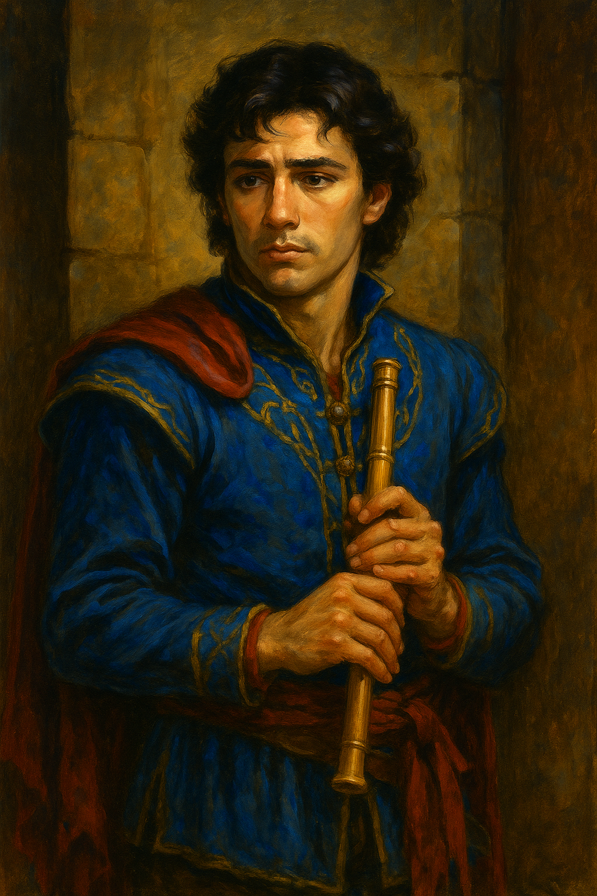

---
aliases:
  - Avrous
---

**Role:** Member of the [[Ravenguard]]; bard, spokesperson, and field negotiator  
**Race:** Human  
**Age:** 27  
**Class/Profession:** **Bard (College of Diplomacy and Song)** — trained to inspire, de-escalate, and navigate interpersonal currents as deftly as battlefields.  
**Faith:** 
**Appearance:** Youthful and striking, with dark curls and expressive eyes. His attire once bore polished silver threads and flowing sashes, now dulled and torn from recent trials. Often wears a look that oscillates between earnest conviction and carefully measured composure.  
**Reputation:** Charismatic, emotionally aware, and quick-thinking. Known to **defuse conflict**, elevate team morale, and carry the weight of loss more than he shows.  
**Appears in:** [[The Threshold – An Examination of Cost]] 

---

### 🧠 Personality & Strengths

- **Emotionally intelligent**, sensitive to unspoken dynamics in a group.
- Speaks **last when uncertain, first when others hesitate**.
- Serves as the [[Ravenguard]]’s **“voice in the room”** when dealing with Guild liaisons, local authorities, or rival parties.
- Driven not by glory, but **legacy and meaning**—wants the tale to be worth telling.
- Balances romanticism with growing realism, especially in the wake of personal loss.

---

### 📊 Position in the Bonus Dispute

- Nominated by [[Hillcrack the Mighty|Hillcrack]] for **Field Merit Recognition**, citing Avrous’s stabilizing presence during mission collapse.
- [[Bakler Underbite|Bakler]] countered that Avrous held the team together after [[Mira]]’s death, and that his decisions **“prevented a third cloak on the floor.”**
- [[Sepora Duskblade|Sepora]] privately acknowledges she has leaned more heavily on Avrous than she intended, and credits him for bringing both clarity and conscience to the Ravenguard’s darkest hour.

---

### 🔍 Symbolism

Avrous embodies the often misunderstood archetype of:

> The **emerging leader**—still unproven, but rising in the fire.

He prompts reflection on questions relevant to many organizations and teams:

- When does **emotional labor** count as leadership?
- How do we evaluate those who **don’t command**, but **connect**?
- Is legacy earned through victory—or **through how one carries loss**?

Avrous doesn’t know all the answers. But in the shadow of grief and unfinished stories, he’s beginning to ask the right questions—and that, too, is a kind of leadership.