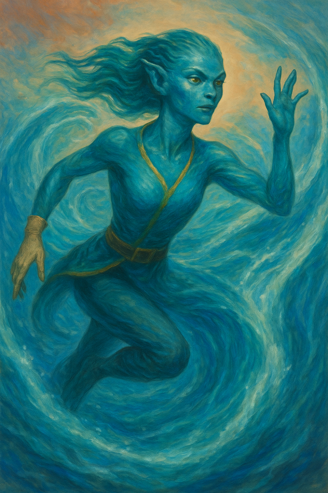

---
aliases:
  - Claina
---

**Role:** Council member of the [[Diligent Order of Locksmiths]]; voice of policy fluidity, strategic reform, and institutional velocity  
**Ancestry:** **[[Kalidor]]** — aquatic simian-like folk who move like water and think like tide patterns  
**Age:** 34  
**Profession:** **Lockwright-Strategist** — specialist in structural guild design, legal innovation, and symbolic mechanism theory  
**Faith:** Follower of **[[Tamaral]] the Opener**, though her reverence is expressed through practice, not prayer. She sees locks not just as puzzles, but as philosophies—each one a potential dialogue with Tamaral’s doctrine of earned understanding.  
**Appearance:** Lean, fluid in motion, and always half-in-motion. Her skin shimmers with oceanic sheen, her gill slits pulse with breath, and her fingers flicker like signals cast into water. Attire is precision-tailored with coral-thread trim and gloves always immaculate.  
**Reputation:** Known for **cutting through tradition like a riptide**. Disruptive, fast-moving, and controversial—but often prescient. Some call her impatient; others call her the Guild’s future. She rarely waits for the room to catch up.
**Appears in:** _[[The Keys of Continuance – An Examination of Succession]]_

---

### 🧠 Personality & Strengths

- Intellectually agile, **policy-forward**, and fluent in the subcurrents of guild power.
- Operates in swells: moments of stillness followed by cascades of decisive insight.
- **Sees systems as puzzles**—not static structures, but patterns to be improved.
- Claina rarely argues from emotion; she lets evidence and velocity do the speaking.
- Believes stability **should be earned repeatedly**, not inherited by default.

---

### 📊 Position in the Succession Debate

- One of the three Ringed Council members backing **[[Jolek P’lot]]**.
- Believes Valora’s leadership would **preserve a system that’s stagnating**.
- Cautions that failure to evolve will mean losing key contracts to [[Cashmei]].
- Delivered one of the sharpest critiques during deliberation:  
    _“The Guild honors precision, not nostalgia. Legacy without leverage is just weight.”_

---

### 🔍 Symbolism

Claina Boltstump represents the **innovator's burden in legacy institutions**:

> The reformer who sees the inefficiencies—but must convince those who built them.

She invites deeper questions about leadership and momentum:

- Is speed dangerous—or is it the only defense against obsolescence?
- How do we weigh tradition when the world shifts faster than we do?
- What does it mean to honor the past without anchoring the future?

She doesn’t walk reverently through the hall of past Grand Keys—she walks briskly, eyes forward, already mapping the next corridor.