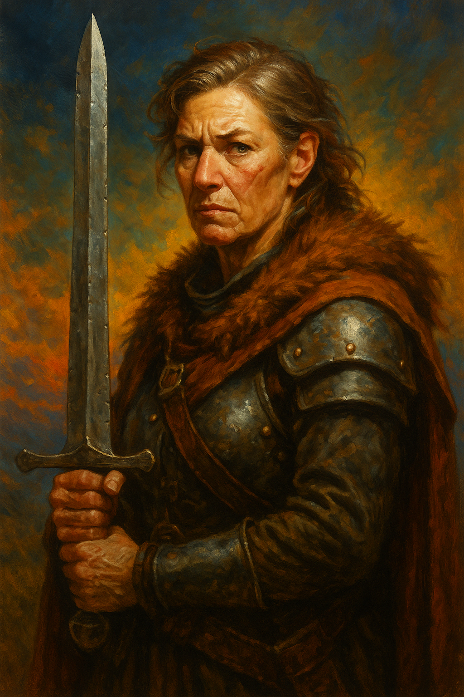

---
aliases:
  - Cora
---

**Role:** Senior guard and trusted veteran of [[Argus Leyline]]’s caravan, originally hired through [[Jacob Nightfeather|Jacob]]’s recommendation  
**Race:** Human  
**Age:** Early 40s  
**Class/Profession:** **Martial protector and survivalist** — likely a fighter, scout, or weather-hardened caravan warden with extensive experience in wilderness defense and crisis navigation  
**Faith:** Not specified; likely pragmatic or skeptical toward religion, with reverence for personal resilience over divine guidance  
**Appearance:** Not described in detail, but strongly implied to be weathered, muscular, scarred; someone who carries herself with presence, not polish  
**Reputation:** Feared and respected. Known for clear judgment and unshakable discipline, but also for being **intolerant of unproven talent**. Her trust is earned, and once broken, rarely restored.  
**Appears in:** [[The Storm and the Ledger – An Examination of Trust]]

---

### 🧠 Personality & Strengths

- **Disciplined, unsentimental, and sharp-eyed.** She doesn’t miss much, and rarely offers her opinion unless it’s founded in hard-earned experience.
- Has survived ambushes, storms, poor leadership, and worse—those scars have made her both skeptical and indispensable.
- Holds others to high standards because she holds herself to even higher ones.
- Speaks plainly and with conviction; rarely hedges, and often assumes responsibility for others' oversights.
- **Believes in earned trust** above all—and bears a low tolerance for untested individuals in moments of real risk.

---

### ⚖️ Position in the Trust Dilemma

- Represents the philosophy that **“trust must be earned”**—grounded in the loss of a former protégé she vouched for who died due to poor judgment.
- Sees [[Sarah the Wayfinder|Sarah]] not as a threat, but as an unnecessary variable—someone who hasn’t proven herself and carries too much uncertainty.
- Offers an alternative route to the watchtower: slower but known. Her position is not rigid for its own sake—it’s protective. It’s the route where she knows she can keep people alive.
- Pushes back on [[Argus Leyline|Argus]] not to undermine him, but to anchor him in precedent and real-world consequence.

---

### 🔍 Symbolism

Cora represents a leadership archetype found in both fantasy and real-world organizations:

> The **trusted execution expert** whose trauma makes them cautious to the point of inflexibility.  
> Her presence challenges questions like:

- What happens when proven judgment becomes resistant to change?
- How do we respect experience while leaving room for emergence?
- Is protecting others the same as empowering them?