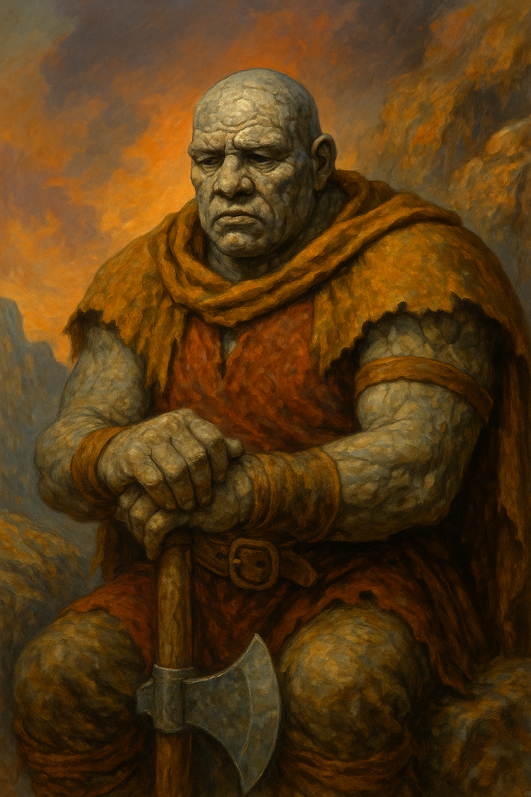

---
aliases:
  - Hillcrack
---

**Role:** Active member of the [[Ravenguard]]; senior melee specialist and spiritual compass of the group  
**Race:** **[[Telma]]** — a rare, earth-touched people with stone-marked skin and a deep cultural reverence for endurance, legacy, and natural wisdom  
**Age:** 42  
**Class/Profession:** **Barbarian (Path of the Rooted Stone)** — a defensive, ground-bound path focused on resilience, tremor sense, and standing one’s ground rather than raging charge  
**Faith:** Cultural reverence for the **Living Earth**; believes in ancestral memory, the voice of stone, and fate etched by pressure over time  
**Appearance:** Massive and slow-moving, with skin like weathered granite and deep-set eyes. Dust clings to him like a second skin, and his movements echo like shifting boulders. Often mistaken for slow, but his words carry weight.  
**Reputation:** Respected by peers for his **steadiness under pressure** and moral clarity. Often acts as the tie-breaking vote in tense decisions. Known to **de-escalate with presence**, not volume.  
**Appears in:** [[The Threshold – An Examination of Cost]] (Main)

---

### 🧠 Personality & Strengths

- Grounded, contemplative, and quietly perceptive.
- Possesses deep **emotional wisdom**, often speaking last—but saying what others needed to hear.
- Known for his **unshakeable loyalty** and belief in finishing what one starts.
- **Rarely initiates plans**, but gives others the confidence to carry them through.
- **Carries emotional burdens for the group**, sometimes silently to a fault.

---

### 📊 Position in the Bonus Dispute

- [[Avrous Detro|Avrous]] informally suggested Hillcrack for **Distinguished Adventurer** status, citing his calming influence and morale leadership.
- [[Sepora Duskblade|Sepora]] argued that Hillcrack is **the reason they didn’t break apart** in the [[Skeleton King]]’s tomb, and that without him, the team would have crumbled.
- The matter is still under review; some feel Hillcrack represents the **“invisible spine”** of the Ravenguard.

---

### 🔍 Symbolism

Hillcrack represents an often-overlooked figure in group dynamics:

> The **emotional cornerstone**—not flashy, not vocal, but essential to cohesion and morale.

He challenges common metrics of advancement by prompting questions like:

- How do we measure **resilience** and **moral steadiness** in a world that celebrates charisma?
- Do we only reward those who lead from the front—or also those who **hold the center** when others fracture?
- What does leadership look like when it’s silent, stabilizing, and shaped like stone?