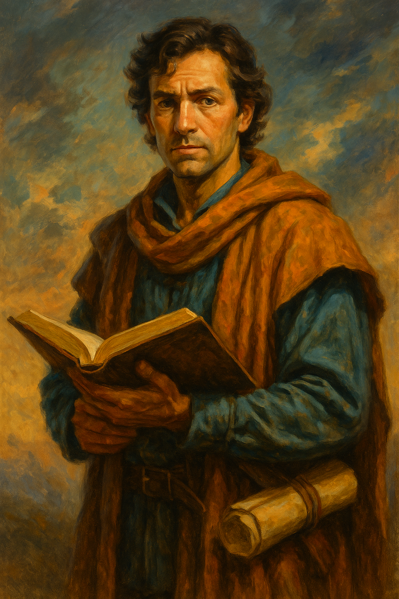

---
aliases:
  - Jacob
---

**Role:** Senior advisor and talent-spotter within [[Argus Leyline]]’s caravan; formerly a guild scribe, now a quiet strategist respected by the crew  
**Race:** Human  
**Age:** Late 30s to early 40s  
**Class/Profession:** **Logistical evaluator and caravan intelligence officer** — skilled in people assessment, operational planning, and long-term personnel strategy  
**Faith:** Not specified; pragmatic and observational, believes more in systems and people than gods  
**Appearance:** Not fully described, but implied to be soft-spoken, keen-eyed, and unassuming; more scholar than soldier, but carries quiet authority  
**Reputation:** Highly respected for his **ability to read people** and advocate for long-term potential over short-term polish. Not a loud voice—but a trusted one.  
**Appears in:** [[The Storm and the Ledger – An Examination of Trust]]

---

### 🧠 Personality & Strengths

- Quietly analytical, with a proven track record for recognizing latent skill in others—**he spotted [[Cora of the Wheel|Cora]] before she was proven**.
- Values systems, credentials, and institutions—but doesn’t follow them blindly; he uses them as tools, not doctrines.
- Seen as an emotional steadying presence within the caravan. Rarely intervenes, but when he does, his words carry weight.
- Respects the tension between potential and proof—and often acts as a **counterweight to [[Cora of the Wheel|Cora]]’s skepticism**.

---

### ⚖️ Position in the Trust Dilemma

- **Supported [[Sarah the Wayfinder|Sarah]]** when most others doubted her, based not on optimism but on observation and gut-backed evidence.
- Watched her closely during the journey—not just for what she did, but how she adjusted. His backing of her is deliberate.
- His quiet comment—“Sometimes the only map you get is a person”—offers Argus a powerful, balanced counterpoint to Cora’s principle of earned trust.
- His endorsement shifts the weight of the debate: **[[Argus Leyline|Argus]] trusts Jacob’s eye**, and Jacob had once vouched for Cora herself.

---

### 🔍 Symbolism

Jacob represents the underappreciated leadership archetype:

> The **quiet evaluator** who bridges the gap between tradition and change.  
> His character provokes questions like:

- How do we build trust in others without demanding perfection first?
- What’s the value of calm, patient observation in high-pressure moments?
- What does it mean to be right when you’re the only one who sees it?