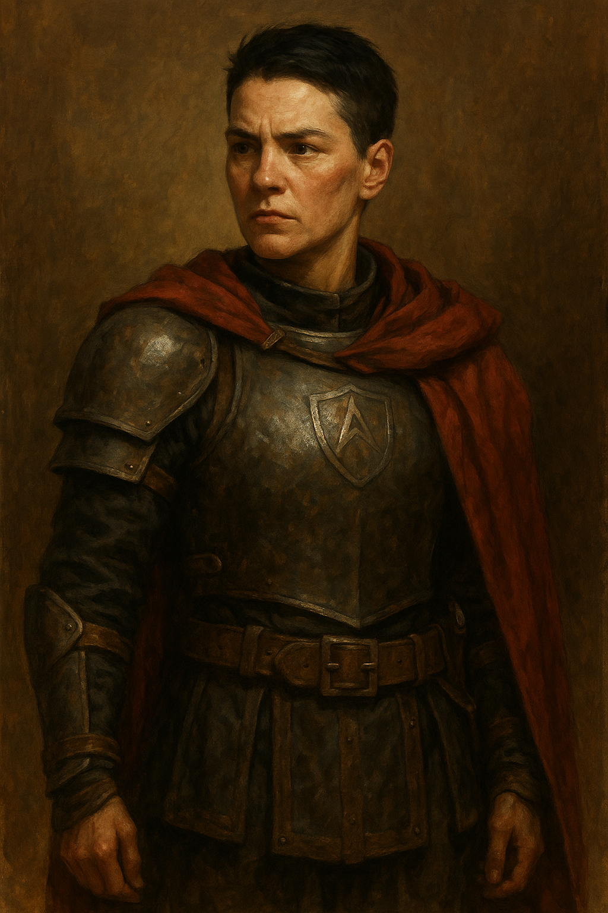

---
aliases:
  - Nora
---

**Role:** Head of Procurement for  [[The Honorable Brotherhood of Watchmen, Protectors, and Bodyguards]]
**Race:** Human  
**Age:** Late 40s  
**Class/Function:** Martial Leader (Fighter/Logistics Specialist Archetype)  
**Alignment:** Lawful Neutral  
**Background:** Guild Officer  
**Faction:** The Honorable Brotherhood (Minor Guild)
**Appears In:** [[The Blackpowder Decision - An Examination on Adoption of the Cutting Edge]]

---

### 🧭 Description:

Captain Nora Greyhelm is a battle-tested officer who carries herself with quiet authority. She wears her standard-issue gear without modification, and her cropped black hair never leaves her helm when on duty. Everything about her posture and presence speaks of _deliberate restraint_. She does not waste words, favors, or coin. Her loyalty is to the **institution**, not to sentiment, but that doesn’t mean she lacks heart—only that she carries it under armor.

---

### 🎯 Personality:

- **Measured:** Never rushes decisions, even under pressure.
- **Pragmatic:** Values stability, discipline, and systems that endure.
- **Wary of Fads:** Her skepticism toward unproven innovations is rooted in past failures—both hers and others'.
- **Protective of Reputation:** She believes an institution’s standing is as important as its function.

---

### 🗣️ Voice:

Nora speaks in short, direct sentences. She rarely raises her voice, but when she does, it commands silence. Her praise is rare—but when given, it carries enormous weight. She will challenge carelessness and insubordination immediately, but she does so with the authority of a builder, not a breaker.

---

### 📜 Key Quotes:

- “We are not in the business of collecting curiosities.”
- “Discipline is not inertia. But it _can_ be camouflage for fear.”
- “If it works, I’ll take it to the High Stewards myself. But not before. And not without proof.”

---

### 📉 Known Conflicts:

- Struggles to reconcile the Brotherhood’s fading relevance with its foundational principles.
- Wary of officers like [[William Book]], who push change too quickly—though she recognizes their potential.
- Faces growing pressure from the High Stewards and internal guild leadership to justify expenditures and keep the Brotherhood from being absorbed or replaced.