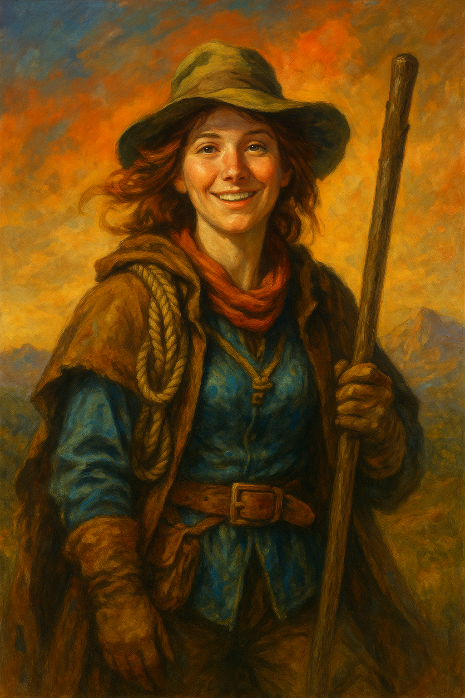

---
aliases:
  - Sarah
---

**Role:** Replacement scout assigned by the [[Wanderer’s Guild]] to lead [[Argus Leyline]]’s caravan during a critical delivery route  
**Race:** Human  
**Age:** Late 20s to early 30s  
**Class/Profession:** **Pathfinder and emergency route specialist** — trained in terrain reading, shelter logistics, and route improvisation; operates under guild certification standards  
**Faith:** Not discussed; comes across as secular, instinct-driven, and quietly resilient  
**Appearance:** Not explicitly detailed, but implied to have a light, unassuming presence—someone who can fade into the background until suddenly commanding focus  
**Reputation:** Viewed as untested and too casual by veterans like Cora, but shows flashes of exceptional clarity under pressure. Appears unserious at first, but **capable when it counts**.  
**Appears in:** [[The Storm and the Ledger – An Examination of Trust]]

---

### 🧠 Personality & Strengths

- **Clever, observant, and quirky**—quick with jokes, but never careless.
- Uses humor as a form of disarming confidence; rarely shaken, even when dismissed or overlooked.
- Shifts demeanor when stakes rise: becomes measured, focused, and efficient.
- Trained and certified by the [[Wanderer’s Guild]], with field credentials others overlook due to her tone.
- **Possesses quiet resilience**—doesn’t push back when excluded, but remains prepared to step up when needed.

---

### ⚖️ Position in the Trust Dilemma

- The subject of the central question: _Can someone be trusted before they’ve proven themselves?_
- Her early behavior—light, flippant, unstructured—sets the stage for skepticism.
- Faces open resistance from [[Cora of the Wheel|Cora]] and passive doubt from the caravan, but never protests her role or pushes for authority.
- Her transformation during the storm—clarity of direction, absence of panic—becomes the emotional hinge for Argus’s decision.
- **Doesn’t demand trust**—but doesn’t shrink from responsibility either. Her presence becomes a quiet challenge to established dynamics.

---

### 🔍 Symbolism

Sarah represents a familiar archetype in teams and leadership structures:

> The **overlooked but competent newcomer** whose surface demeanor obscures deeper ability.  
> Her character invites reflection on:

- How we recognize talent when it doesn’t “look” the part
- The cost of early missteps in credibility
- The tension between presentation and performance
- What it means to rise when no one is watching