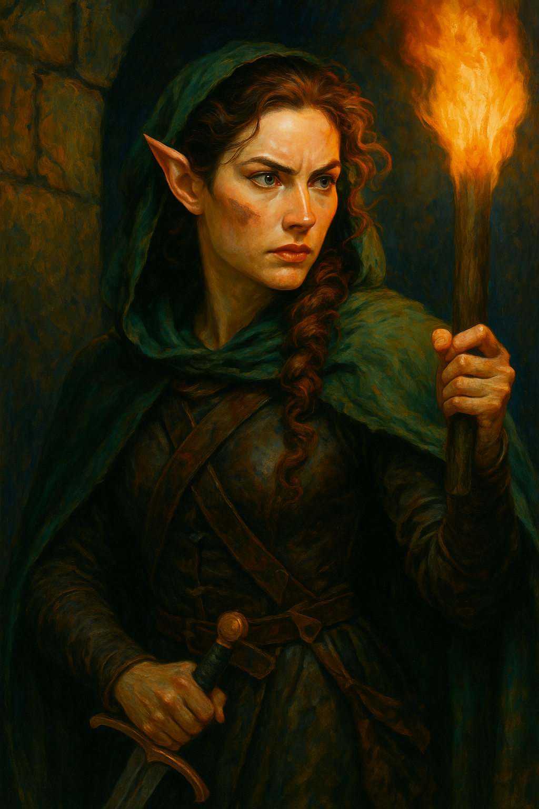

---
aliases:
  - Sepora
---

**Role:** Adventurer in good standing with the [[Adventurer's Guild]]; strategist and founding member of the **[[Ravenguard]]**  
**Race:** Elf  
**Age:** 118 (appears mid-30s by human standards)  
**Class/Profession:** **Rogue (Scout/Strategist)** — excels in infiltration, mapping, and logistical planning with a mind for risk assessment and reward modeling  
**Faith:** Unclear; possibly secular or casually reverent of [[Jopli]] through proximity to [[Bakler]]  
**Appearance:** Angular features, dark green cloak (torn and soot-streaked), soot-smeared cheek, braided hair now unraveling into wild curls  
**Reputation:** Known for her tactical mind, persuasive confidence, and ability to rally consensus—until the cost hits. Viewed by some as bold and future-focused; by others as reckless or overconfident.  
**Appears in:** [[The Threshold – An Examination of Cost]]

---

### 🧠 Personality & Strengths

- Exceptionally sharp; sees patterns in risk/reward scenarios and pushes toward legacy-defining choices
- Strategic communicator—able to sell ambitious plans with compelling clarity
- Brave to the point of stubbornness; driven by fear of mediocrity more than fear of death
- Deep sense of responsibility, but masks guilt with forward momentum

---

### 📊 Position in the Tomb Dilemma

- Sepora was the **architect of the [[Skeleton King]] contract**, framing it as a high-risk, high-reward move that could elevate the [[Ravenguard]]’s standing
- After the deaths of two teammates, her insistence on continuing is met with internal resistance—particularly from [[Bakler Underbite]]
- Her belief: the goal is within reach, and retreat now would render all sacrifice meaningless
- Her flaw: blinded by sunk cost and personal stake, she underestimates the group’s dwindling capacity

---

### 🔍 Symbolism

Sepora represents the **visionary operator** in both fantasy and real-world teams:

> The **planner who dares big**, gets buy-in, and leads into danger—but doesn’t always fully own the cost when things fall apart.

She raises enduring questions:

- Is belief in a plan enough to justify the toll?
- Do those who convince others to take risks owe more when those risks turn lethal?
- What separates a bold leader from a reckless one—results, or regret?