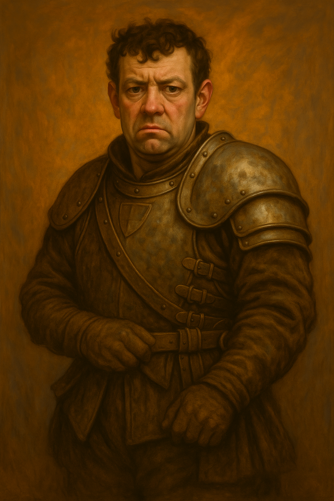

**Role:** Quartermaster’s Lieutenant and Reform Advocate  
**Race:** Human  
**Age:** Early 30s  
**Class/Function:** Fighter (Support/Logistics Focus) with a splash of Artificer/Engineer flavor  
**Background:** Guild Tradesman → Commissioned Officer  
**Faction:** [[The Honorable Brotherhood of Watchmen, Protectors, and Bodyguards]]
**Appears in:** [[The Blackpowder Decision - An Examination on Adoption of the Cutting Edge]]

---

### 🧭 Description:

William Book is tall, wiry, and always in motion. His uniform is technically correct but shows signs of ongoing experiments—extra loops, reinforced sleeves, graphite smudges on his gloves. He has the face of someone constantly calculating outcomes, sometimes too quickly. His optimism reads as persistence to some, recklessness to others.

---

### 🎯 Personality:

- **Driven:** Believes the Brotherhood must evolve or perish.
- **Loyal:** Not trying to abandon the institution—he’s trying to save it.
- **Tinkerer:** Always has a sketch, a prototype, or a half-finished report in his satchel.
- **Humbled:** Past failures have made him less brash, but not less bold.

---

### 🗣️ Voice:

William speaks quickly and often interrupts himself when excited. He’s respectful but impatient, especially with what he sees as outdated constraints. His voice softens when he talks about the Brotherhood’s future—but tightens when discussing his past proposals that were ignored or failed.

---

### 📜 Key Quotes:

- “I don’t want to leave this place, Captain. But I’m running out of ways to help it survive.”
- “This isn’t theory. This isn’t a sketch on a board. It tore through plate. It _works_.”
- “We’re not just behind—we’re humiliated.”

---

### 📉 Known Conflicts:

- Often at odds with upper leadership due to bypassing protocol or pushing too hard.
- Genuinely respects [[Nora Greyhelm]], but feels frustrated by the slow pace of her decisions.
- Burned by past failed pitches—throwable glue bags, brittle lightweight alloy, and a high-intensity drill that hospitalized three veterans.